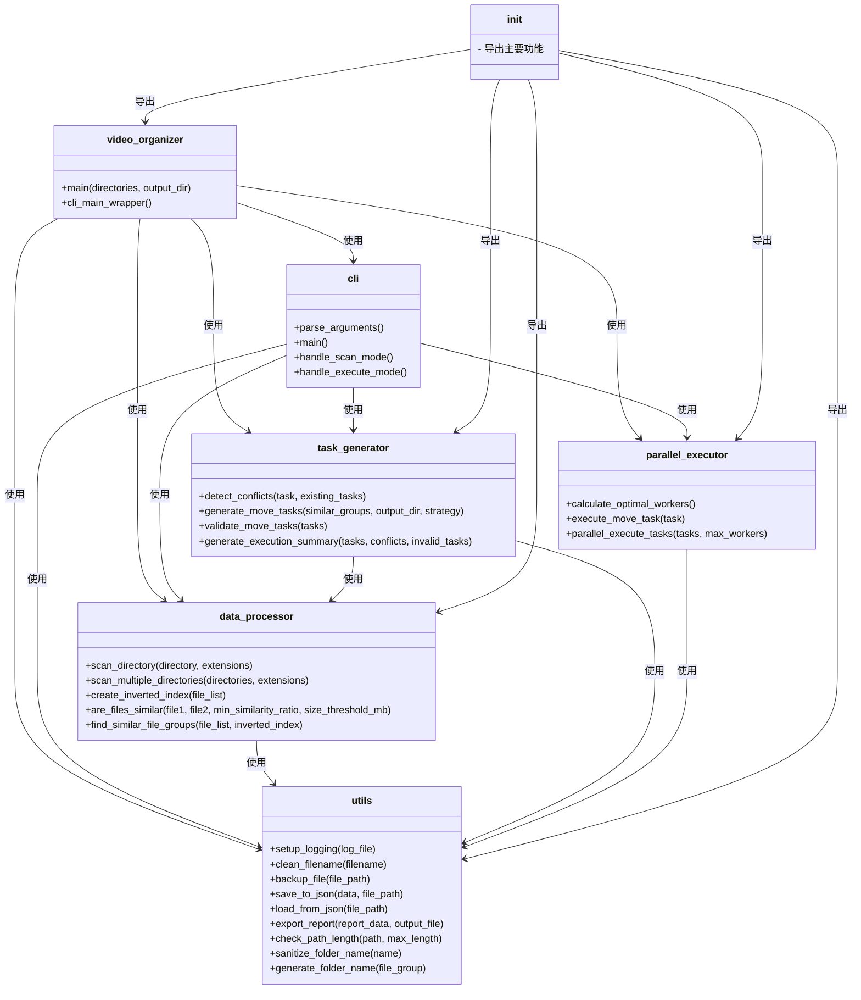
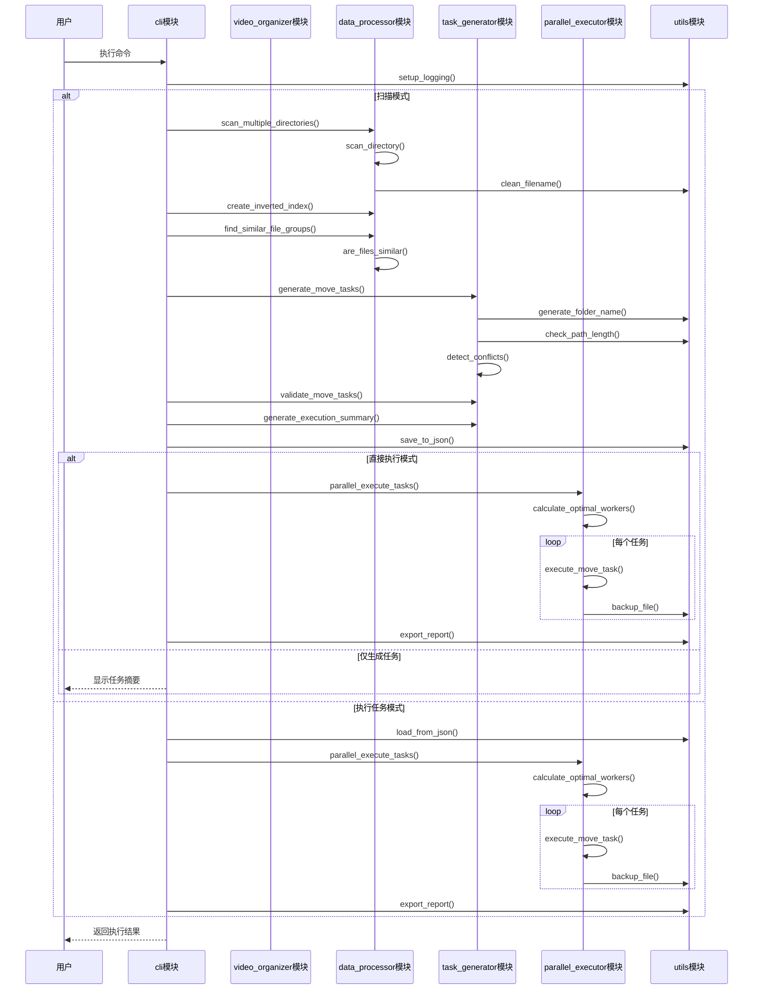
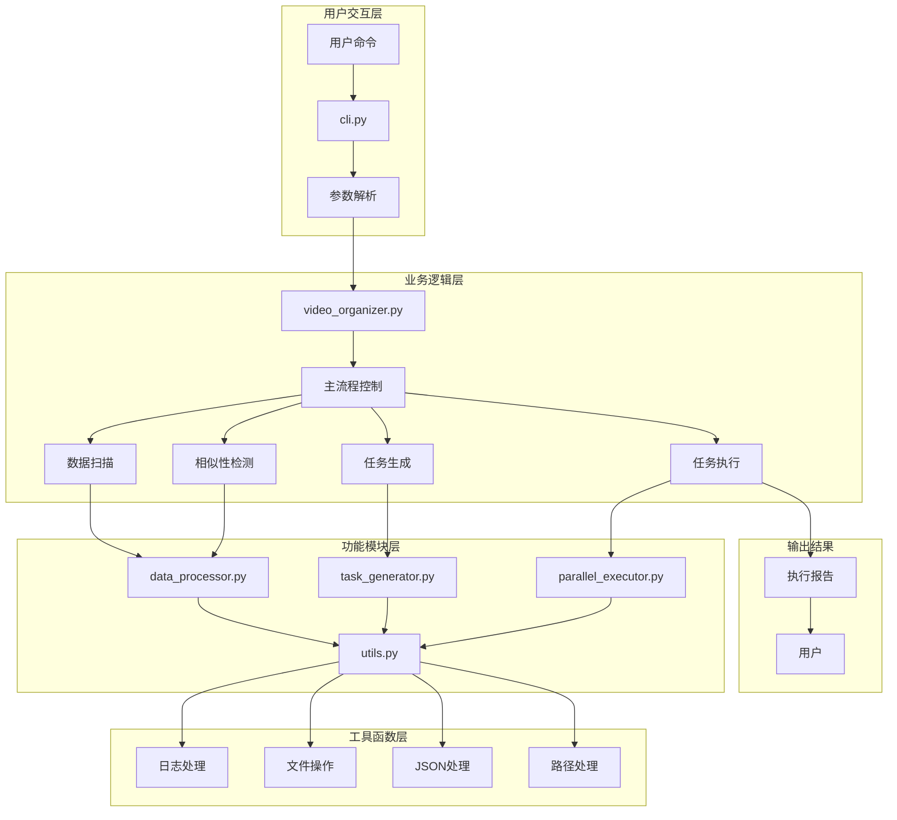

# TidySameVideo 项目架构图

## 1. 模块依赖关系（类图）

## 2. 主要执行流程（时序图）

## 3. 核心功能模块调用关系图

## 4. 模块功能概述

### 4.1 utils.py - 工具函数模块
- 提供各种辅助功能，如日志配置、文件清理、备份、JSON处理等
- 为其他所有模块提供基础支持

### 4.2 data_processor.py - 数据处理模块
- 负责扫描目录中的视频文件
- 创建文件索引以便快速查找
- 实现相似文件检测算法
- 将相似文件分组

### 4.3 task_generator.py - 任务生成模块
- 基于相似文件组生成移动任务
- 检测任务冲突
- 验证任务有效性
- 生成执行计划摘要

### 4.4 parallel_executor.py - 并行执行模块
- 计算最佳工作线程数
- 实现单个文件移动任务执行
- 提供并行任务执行框架
- 显示执行进度和结果统计

### 4.5 cli.py - 命令行接口模块
- 解析命令行参数
- 提供多种运行模式（扫描、执行任务）
- 协调各个功能模块的工作流
- 生成和显示报告

### 4.6 video_organizer.py - 主模块
- 提供向后兼容的接口
- 协调各个子模块的调用
- 实现完整的视频整理流程